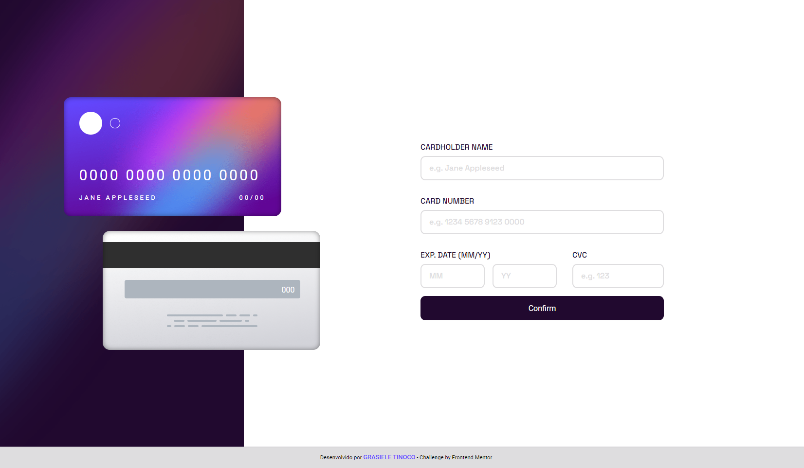

# Frontend Mentor - Interactive Card Details Form

### 💻 Descodificadas - Trilha 3: Desafio Interactive Card Details Form

#### 📝Desafio:

Desenvolver um site seguindo o Challenge "Interactive Card Details Form" do site Frontend Mentor e fazer com que fique o mais próximo possível do design proposto.

#### 📌Os Usuários Devem ser Capazes de:

- Preencher o formulário e ver os dados do cartão atualizados em tempo real.
- Receber mensagens de erro de validação ao enviar o formulário, caso: 
   - Qualquer campo de entrada esteja vazio.
   - Os campos do número do cartão, data de validade ou CVC não estejam no formato correto.
- Visualizar o layout ideal conforme o tamanho da tela do dispositivo utilizado.

#### 🛠️Tecnologias Utilizadas:

- HTML
- CSS
- JavaScript
